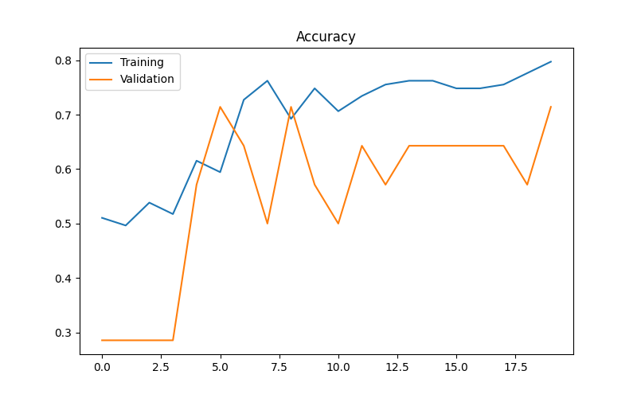
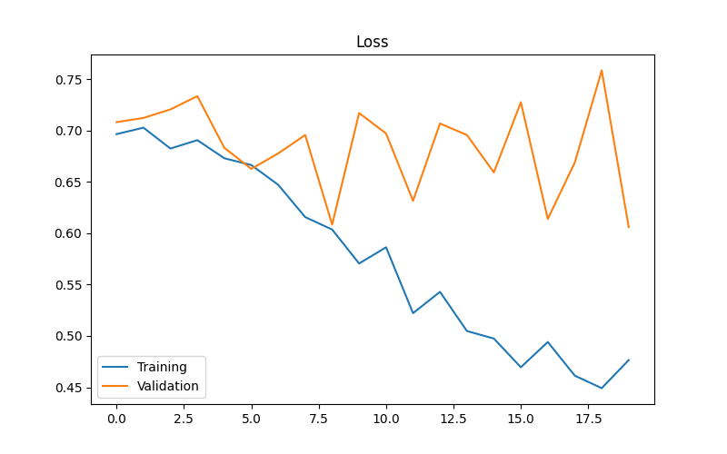
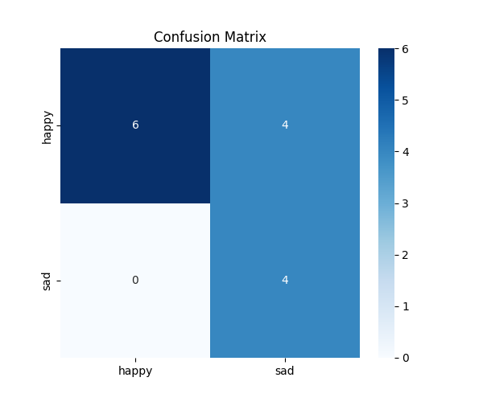

# 😊 Face Emotion Classification using CNN

A Deep Learning project that classifies facial emotions (Happy vs Sad) using Convolutional Neural Networks (CNN) built with TensorFlow and Keras. Includes image preprocessing, model training, evaluation, prediction, and performance visualization.

---

## 📖 Project Overview

This project implements a **Convolutional Neural Network (CNN)** using **TensorFlow** and **Keras** to classify facial expressions into two categories:

- 😊 Happy
- 😢 Sad

The project demonstrates the complete Deep Learning workflow, including:

- Data preprocessing
- Image augmentation
- CNN model development
- Model training
- Model evaluation
- Performance visualization
- Confusion Matrix
- Classification Report
- Single image prediction

---

## 🚀 Features

- Binary Face Emotion Classification
- CNN built from scratch
- Image preprocessing using ImageDataGenerator
- Data Augmentation
- Training & Validation
- Accuracy & Loss visualization
- Confusion Matrix
- Classification Report
- Model Saving & Loading
- Predict custom images

---

# 🧠 CNN Architecture

```
Input Image (200×200×3)

        │
        ▼

Conv2D (32 Filters)

        │
        ▼

MaxPooling2D

        │
        ▼

Conv2D (64 Filters)

        │
        ▼

MaxPooling2D

        │
        ▼

Conv2D (128 Filters)

        │
        ▼

MaxPooling2D

        │
        ▼

Flatten

        │
        ▼

Dense (128)

        │
        ▼

Dropout (0.5)

        │
        ▼

Output Layer (Sigmoid)

        │
        ▼

Happy 😊  /  Sad 😢
```

---

# 📂 Dataset Structure

```
dataset/

│── training/

│   ├── happy/

│   └── sad/

│

└── testing/

    ├── happy/

    └── sad/
```

---

# 📁 Project Structure

```
Face-Emotion-Classification-CNN/

│── dataset/
│   ├── training/
│   └── testing/
│
│── screenshots/
│   ├── training_accuracy.png
│   ├── training_loss.png
│   └── confusion_matrix.png
│
│── model/
│   └── face_emotion_model.keras
│
│── notebook/
│   └── face_emotion_classification.ipynb
│
│── requirements.txt
│── README.md
```

---

# ⚙️ Technologies Used

- Python
- TensorFlow
- Keras
- NumPy
- Matplotlib
- Seaborn
- OpenCV
- Scikit-learn
- Pillow

---

# 📦 Installation

Clone the repository

```bash
git clone https://github.com/manasranjanmeher99/Face-Emotion-Classification-CNN.git
```

Go to the project folder

```bash
cd Face-Emotion-Classification-CNN
```

Install dependencies

```bash
pip install -r requirements.txt
```

---

# ▶️ Run the Project

Open Jupyter Notebook

```bash
jupyter notebook
```

Run

```
face_emotion_classification.ipynb
```

---

# 📊 Model Performance

The model is evaluated using:

- Training Accuracy
- Validation Accuracy
- Training Loss
- Validation Loss
- Confusion Matrix
- Classification Report
- Precision
- Recall
- F1-Score

---

# 📈 Training Graphs

## Accuracy Curve



---

## Loss Curve




---

## Confusion Matrix




---

# 📊 Sample Output

```
Validation Accuracy : 71.43%

Validation Loss : 0.6061
```

Example Prediction

```
Input Image

        │

        ▼

CNN Model

        │

        ▼

Prediction

😊 Happy
```

---

# 💾 Save Model

```python
model.save("face_emotion_model.keras")
```

Load Model

```python
from tensorflow.keras.models import load_model

model = load_model("face_emotion_model.keras")
```

---

# 🔮 Future Improvements

- Real-time Webcam Emotion Detection
- Multi-class Emotion Recognition
- Face Detection using OpenCV
- Transfer Learning (MobileNetV2)
- Streamlit Web Application
- Deploy using Hugging Face Spaces
- Docker Support
- Model Optimization

---

# 📚 Learning Outcomes

This project demonstrates:

- Image preprocessing
- CNN architecture design
- Binary image classification
- Data augmentation
- Deep Learning model training
- Model evaluation
- Performance visualization
- TensorFlow/Keras workflow

---

# 👨‍💻 Author

## Manas Ranjan Meher

**GitHub**

https://github.com/manasranjanmeher99

**LinkedIn**

https://www.linkedin.com/in/manas-ranjan-meher-606954230/

---

# ⭐ Support

If you found this project useful, consider giving it a ⭐ on GitHub.


## 📬 Contact

Feel free to connect with me for collaboration, project discussions, or feedback.

⭐ If you like this project, don't forget to star the repository!
